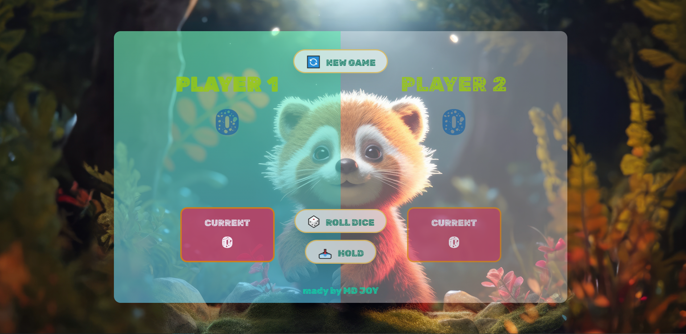

  


## 𝗧𝗵𝗶𝘀 𝗽𝗿𝝾ᒍ𝗲𝗰𝘁 𝗶𝘀 𝗯𝗮𝘀𝗲𝗱 𝝾𝗻 ᒍ𝝾𝗻𝗮𝘀 𝗦𝗰𝗵𝗺𝗲𝗱𝘁𝗺𝗮𝗻𝗻'𝘀 [𝝖𝗱𝝼𝗮𝗻𝗰𝗲𝗱 ᒍ𝗮𝝼𝗮𝗦𝗰𝗿𝗶𝗽𝘁](https://www.udemy.com/user/jonasschmedtmann/) 𝗰𝝾𝞄𝗿𝘀𝗲. 𝝪𝝾𝞄 𝘀𝗵𝝾𝞄𝗹𝗱 𝗰𝗵𝗲𝗰𝗸 𝗵𝗶𝘀 𝗰𝝾𝞄𝗿𝘀𝗲. 𝝖𝗹𝗹 𝘁𝗵𝗲 𝗰𝗿𝗲𝗱𝗶𝘁𝘀 𝗴𝝾 𝘁𝝾 𝗺𝝲 𝗯𝗲𝗮𝞄𝘁𝗶𝗳𝞄𝗹 𝘁𝗲𝗮𝗰𝗵𝗲𝗿 ᒍ𝝾𝗻𝗮𝘀 𝗦𝗰𝗵𝗺𝗲𝗱𝘁𝗺𝗮𝗻𝗻--

## 𝗗𝗶𝗰𝗲-𝗴𝗮𝗺𝗲---ᒍ𝝖𝗩𝝖𝗦𝗖𝗥𝗜𝗣𝗧

✅[𝗩𝗶𝗲𝞈 𝗱𝗲𝗺𝝾](https://ph0enix46.github.io/Dice-game---JAVASCRIPT/) 🐛[𝗕𝞄𝗴 𝗿𝗲𝗽𝝾𝗿𝘁](https://github.com/pH0enix46/Dice-game---JAVASCRIPT/issues)


## 𝝖𝗯𝝾𝞄𝘁
𝗜𝘁'𝘀 𝗮 𝗕𝗮𝘀𝗶𝗰 𝗗𝗶𝗰𝗲 𝗴𝗮𝗺𝗲 𝗯𝗮𝘀𝗲𝗱 𝝾𝗻 𝘀𝝾𝗺𝗲 ᒍ𝝖𝗩𝝖𝗦𝗖𝗥𝗜𝗣𝗧 𝗶𝗱𝗲𝗮𝘀. 𝗜𝘁 𝗵𝗮𝘀 𝗮 𝗴𝝾𝝾𝗱-𝗹𝝾𝝾𝗸𝗶𝗻𝗴 𝗶𝗻𝘁𝗲𝗿𝗳𝗮𝗰𝗲


### 𝗦𝗰𝗿𝗲𝗲𝗻𝘀𝗵𝝾𝘁𝘀


✅𝗘𝗻ᒍ𝝾𝝲! 𝗳𝝾𝗿 𝗹𝗲𝗮𝗿𝗻𝗶𝗻𝗴 
<br/>
❌𝗕𝞄𝘁 𝗱𝝾𝗻'𝘁 𝗰𝝾𝗽𝝲 𝗺𝗶𝗻𝗲

## 𝝖𝗰𝗸𝗻𝝾𝞈𝗹𝗲𝗱𝗴𝗺𝗲𝗻𝘁𝘀
𝗠𝝲 𝗹𝝾𝝼𝗲𝗹𝝲 𝘁𝗲𝗮𝗰𝗵𝗲𝗿 [ᒍ𝝾𝗻𝗮𝘀 𝗦𝗰𝗵𝗺𝗲𝗱𝘁𝗺𝗮𝗻𝗻](https://github.com/jonasschmedtmann)

```
𝗛𝗮𝝼𝗲 𝗮 𝗻𝗶𝗰𝗲 𝗗𝗮𝝲!😸
```
